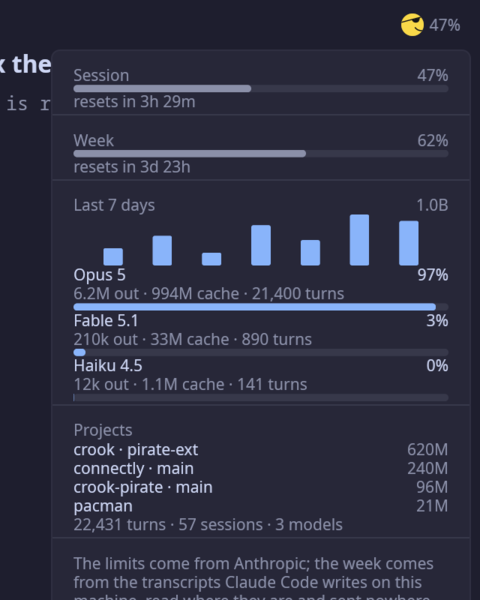
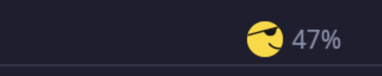

# Pirate

The Claude Code usage chip for [Crook](https://github.com/theguriev/crook), as a plugin the
terminal does not carry.

A pirate sits at the right-hand end of the header with a percentage beside him: how much of
the current Claude Code session budget is spent.


Click him and a panel drops out with the limits behind that number — the rolling five-hour
window and the weekly one, each with a bar and the time left on it — and then the week behind
*those*: a column per day, what each model was used for, and which projects it went on.



The limits come from Anthropic. The week comes from the transcripts Claude Code writes on this
machine — three hundred megabytes of them — and none of it crosses into the sandbox: the
plugin asks Crook to count, saying which lines are the same turn written twice, what to group
by and what to add up, and gets back a couple of hundred rows of totals. Reading it a line at
a time was measured at ninety thousand instructions each, which for a week is forty seconds of
interpreter; counting it where it is read takes about a second, on a thread nobody is waiting
on.

He chomps while a refresh **you asked for** is in flight, and only then — a background poll
every minute animates nothing, because an animation on a timer nobody is watching repaints
the header sixty times for no one.



The mark is Crook's own artwork, asked for by icon name; what this plugin does is name a
different frame of the bite on each render and ask to be woken a hundred and ten milliseconds
later. It cannot draw a pixel of its own.

Crook used to have this in the box. It is here now, outside the binary, and that is the point
of it: this is what a plugin from outside can do.

## Install

Download `plugin.wasm` from the [latest release](https://github.com/theguriev/crook-pirate/releases/latest)
and put it where Crook looks:

```sh
mkdir -p ~/.local/share/crook/plugins/theguriev.pirate
cp plugin.wasm ~/.local/share/crook/plugins/theguriev.pirate/
```

On macOS that directory is `~/Library/Application Support/crook/plugins/`, and on Windows
`%APPDATA%\crook\plugins\`. Then start Crook, open **Settings → Plugins**, select **Pirate**,
and allow the two things it asks for. Nothing happens until you do — see below.

## What it is allowed to do, and what that means

A sandboxed plugin has no network, no filesystem and no thread. It has no way to reach any of
them either: it *asks*, Crook decides whether what it asked for is inside what you allowed,
and the work happens on Crook's side of the boundary. This one asks for two things and uses
both:

| It wants to | Because |
| --- | --- |
| Read `~/.claude/.credentials.json` | That is where Claude Code keeps the session you are signed in with. The plugin reads the access token out of it and nothing else. |
| Read everything under `~/.claude/projects` | The transcripts, which is where the week comes from. Crook walks them and counts; the plugin never sees a line of what you or anyone else wrote. |
| Reach `api.anthropic.com` | To ask `/api/oauth/usage` how much of the limits is gone, with that token. |

Nothing else is asked for and nothing else is reachable. It does not read your transcripts,
your working directory, your tabs or your clipboard, and it cannot: a request naming anything
you did not allow comes back refused, and the plugin has no other door.

**Where the numbers go: nowhere.** The token goes to Anthropic, in the one request that asks
what your own account has spent. Nothing is sent anywhere else and nothing is stored.

## Build it yourself

```sh
rustup target add wasm32-unknown-unknown
cargo test                                             # 64 tests, no wasm toolchain needed
cargo build --release --target wasm32-unknown-unknown
cp target/wasm32-unknown-unknown/release/pirate.wasm plugin.wasm
```

Everything except `src/sys.rs` builds for your own machine, which is how the whole plugin —
when to poll, what to remember, what to draw — is tested by `cargo test` rather than by
installing it and watching a terminal. The imports are stubbed there and answer from a clock
the tests set.

## How it is put together

| | |
| --- | --- |
| `crates/pirate/src/lib.rs` | The ABI: every export Crook calls, each three lines, none of which decides anything. |
| `crates/pirate/src/sys.rs` | The six imports, and the stubs that stand in for them off wasm. |
| `crates/pirate/src/state.rs` | When to ask, what to remember, what a person is waiting on. |
| `crates/pirate/src/claude.rs` | The two JSON shapes: the credentials file and the usage endpoint. |
| `crates/pirate/src/history.rs` | What to have counted out of the transcripts, and what the totals mean. |
| `crates/pirate/src/view.rs` | The chip and the panel, as a tree Crook paints. |
| `crates/pirate/src/time.rs` | Reading a timestamp and saying how long is left, without a date library. |
| `crates/crook_plugin_api/` | A **copy** of Crook's own ABI crate. See the note in its `Cargo.toml`. |

The plugin never names a colour, a pixel or a font. It says *what a thing is* — a mark, a
number, a meter, a note — and Crook decides what that looks like in whatever theme is in
force. The pirate is Crook's own artwork, asked for by name; the plugin only says which frame
of the bite to draw, which is how a sandboxed plugin animates something it cannot paint.

## Licence

MIT. See [LICENSE](LICENSE).
